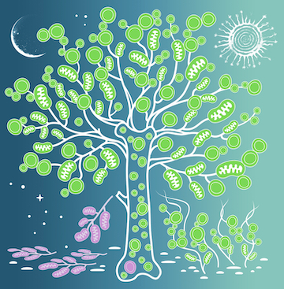

# Tracking rare single donor and recipient immune and leukemia cells after allogeneic hematopoietic cell transplantation using mitochondrial DNA mutations

Code to reproduce analyses of [Penter et al., Blood Cancer Discovery 2024](https://doi.org/10.1158/2643-3230.BCD-23-0138).

.

## intermediate files 

The data needed to reproduce the analyses is hosted on [OSF](https://osf.io/). They need to be downloaded and used to populate the data/ folder. 

[Part1](https://osf.io/brd5u/), [Part2](https://osf.io/7584h/), [Part3](https://osf.io/ngyu4/), [Part4](https://osf.io/zh4tb/), [Part5](https://osf.io/5f9dq/), [Part6](https://osf.io/ghe92/)

## Main figures

The code for the panels of the main figures can be found here. See individual subdirectories for further indications. 

```
Figure 1 | figure_CLL_WES_RNA
Figure 2 | figure_CLL_WES_RNA, figure_coevolution
Figure 3 | figure_mixing
Figure 4 | figure_IST
Figure 5 | figure_10026
Figure 6 | figure_AML_coevolution
Figure 7 | figure_AML_coevolution
```

## Supplementary figures

The code for the panels of the supplementary figures can be found here. See individual subdirectories for further indications. 

```
Suppl. Fig. 1 | figure_CLL_WES_RNA
Suppl. Fig. 2 | figure_CLL_WES_RNA
Suppl. Fig. 3 | figure_CLL_WES_RNA
Suppl. Fig. 4 | figure_CLL_WES_RNA
Suppl. Fig. 5 | figure_CLL_WES_RNA
Suppl. Fig. 6 | figure_CLL_WES_RNA
Suppl. Fig. 7 | figure_coevolution
Suppl. Fig. 8 | figure_coevolution
Suppl. Fig. 9 | figure_coevolution
Suppl. Fig. 10 | figure_mixing
Suppl. Fig. 11 | figure_mixing
Suppl. Fig. 12 | figure_mixing
Suppl. Fig. 13 | figure_IST
Suppl. Fig. 14 | figure_IST
Suppl. Fig. 15 | figure_IST
Suppl. Fig. 16 | figure_10026
Suppl. Fig. 17 | figure_10026
Suppl. Fig. 18 | figure_AML_coevolution
Suppl. Fig. 19 | figure_AML_coevolution
Suppl. Fig. 20 | figure_AML_coevolution
```
